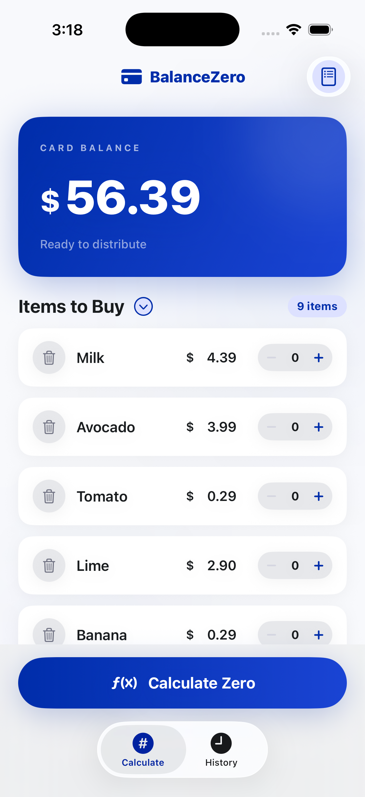
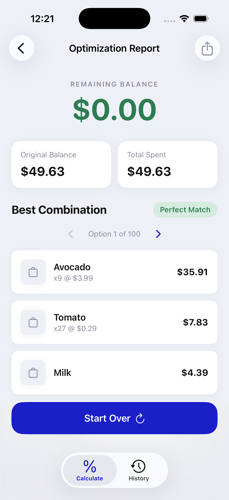
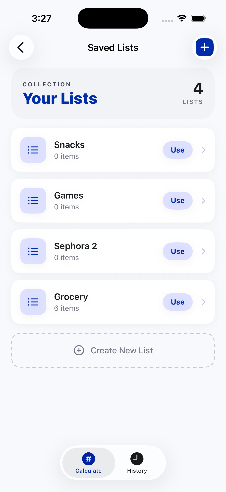

# BalanceZero
> An iOS utility that helps you spend down prepaid/gift card balances by finding the best combination of items to buy (ideally leaving $0.00).

---

## 📱 Preview
| Input (Balance + Items) | Optimization Report | Saved Lists |
| :---: | :---: | :---: |
|  |  |  |

---

## 🚀 Key Features
* **Balance + items entry:** Enter a remaining card balance and a list of items with prices to optimize against.
* **Optimization report (multiple best options):** Finds the closest spend (prefers exact zero) and lets you browse between multiple equally-optimal combinations.
* **History + Saved Lists (SwiftData):** Save past calculations for quick revisit, and store reusable item lists to apply back to new sessions.

---

## 🛠 Tech Stack & Architecture
* **Language:** Swift 5
* **UI Framework:** SwiftUI
* **Architecture:** MVVM (ObservableObject view models)
* **Concurrency:** Swift Concurrency (`Task` + `MainActor`)
* **Data Persistence:** SwiftData (Saved Lists + Calculation History)
* **Networking:** None
* **Dependency Manager:** Swift Package Manager (SPM) — no external dependencies

---

## 🧠 Technical Challenges & Learnings
* **Challenge:** Enumerating and preserving multiple equally-optimal solutions (not just a single “best” result).
* **Solution:** Store all optimal selections and expose option browsing in the report UI to let users pick their preferred combination.
* **Learning:** Treating “best” as a *set* of solutions improves UX and makes history replay accurate and deterministic.

---

## ⚙️ Requirements & Installation
* iOS 26+
* Xcode 17+

1. Clone the repository: `git clone https://github.com/keyursavalia/BalanceZero.git`
2. Open `BalanceZero.xcodeproj`
3. Select a simulator and press **Cmd + R**.

---

## ✍️ Author
* **Keyur Savalia** - [LinkedIn](https://www.linkedin.com/in/keyursavalia)

