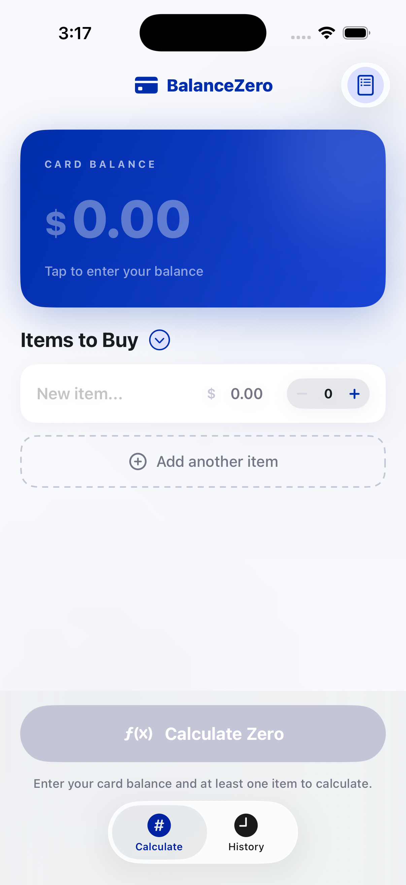
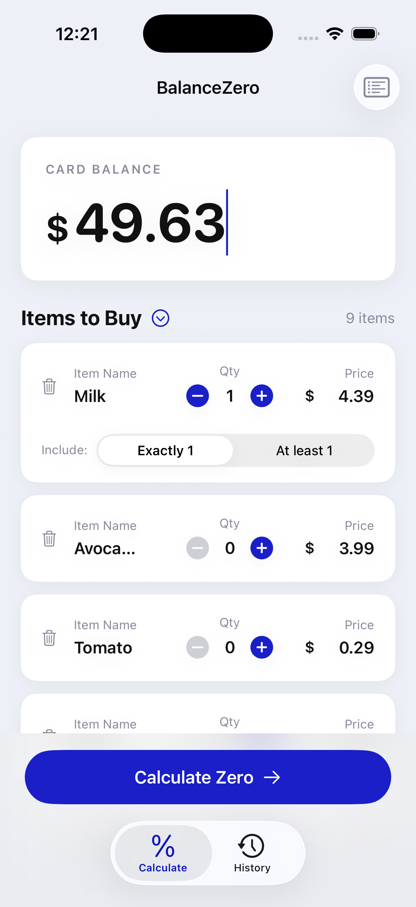
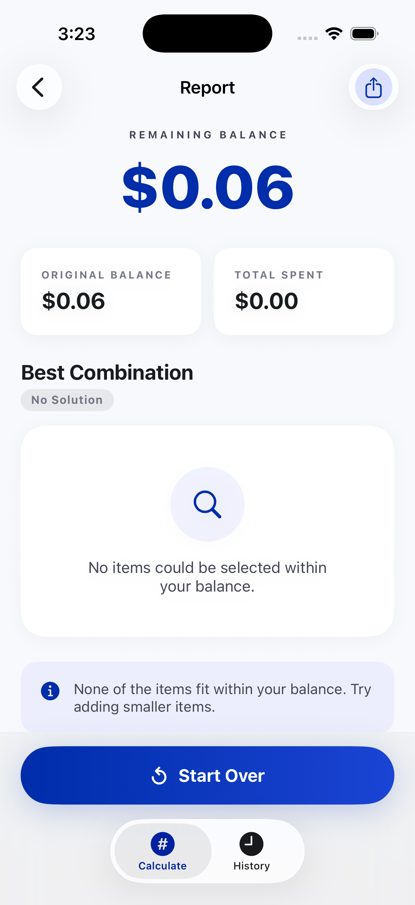
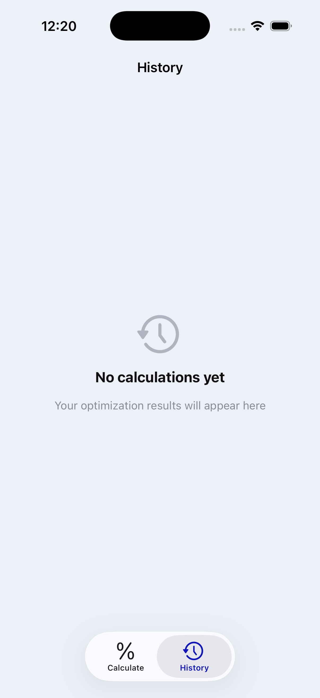
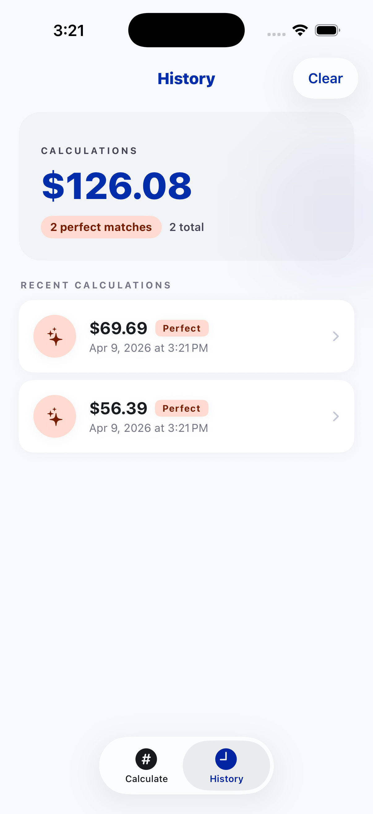
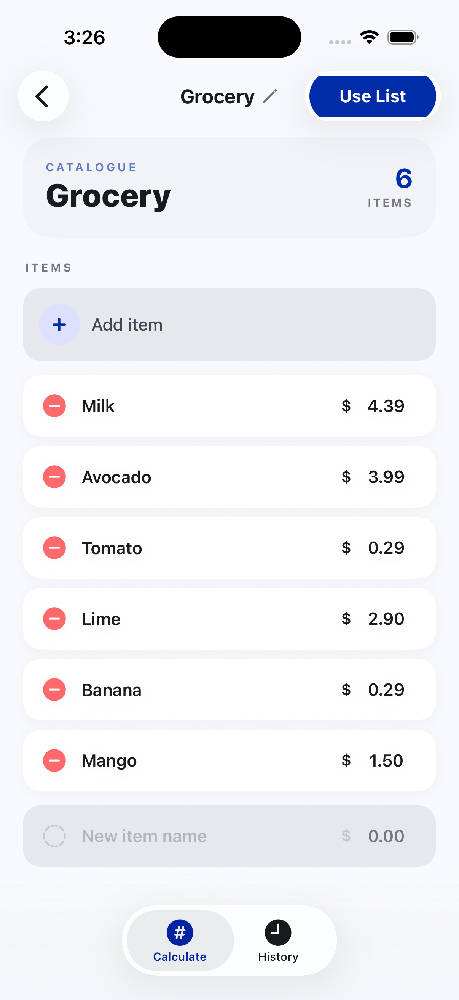
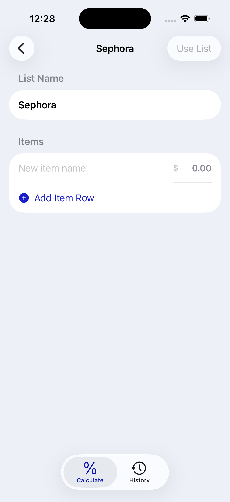

# BalanceZero

> **An iOS utility that helps you spend down prepaid or gift card balances by finding the best combination of items to buy — ideally leaving $0.00.**

BalanceZero is a native SwiftUI app for a narrow, practical problem: you have a fixed amount left on a card and a mental shopping list. Instead of guessing at the register, you enter your remaining balance and item prices; the app runs an optimization to maximize spend (and prefers an exact zero when possible). When several combinations tie for “best,” you can browse them and pick the one that fits how you actually shop.

---

## Screenshots

<p align="center">
  
  &nbsp;&nbsp;
  
  &nbsp;&nbsp;
  
  &nbsp;&nbsp;
  
</p>

<p align="center">
  <sub>Input — empty &nbsp;&nbsp;&nbsp;&nbsp;&nbsp;&nbsp;&nbsp;&nbsp;&nbsp;&nbsp;&nbsp;&nbsp;&nbsp;&nbsp;&nbsp;&nbsp;
  Input — populated &nbsp;&nbsp;&nbsp;&nbsp;&nbsp;&nbsp;&nbsp;&nbsp;&nbsp;&nbsp;&nbsp;&nbsp;&nbsp;
  Input — constraints &nbsp;&nbsp;&nbsp;&nbsp;&nbsp;&nbsp;&nbsp;&nbsp;&nbsp;&nbsp;&nbsp;&nbsp;&nbsp;
  Report</sub>
</p>

<br/>

<p align="center">
  
  &nbsp;&nbsp;
  
  &nbsp;&nbsp;
  
</p>

<p align="center">
  <sub>Report — empty &nbsp;&nbsp;&nbsp;&nbsp;&nbsp;&nbsp;&nbsp;&nbsp;&nbsp;&nbsp;&nbsp;&nbsp;&nbsp;&nbsp;&nbsp;&nbsp;
  History — empty &nbsp;&nbsp;&nbsp;&nbsp;&nbsp;&nbsp;&nbsp;&nbsp;&nbsp;&nbsp;&nbsp;&nbsp;&nbsp;&nbsp;&nbsp;&nbsp;
  History — list</sub>
</p>

<br/>

<p align="center">
  
  &nbsp;&nbsp;
  
  &nbsp;&nbsp;
  
</p>

<p align="center">
  <sub>Saved lists &nbsp;&nbsp;&nbsp;&nbsp;&nbsp;&nbsp;&nbsp;&nbsp;&nbsp;&nbsp;&nbsp;&nbsp;&nbsp;&nbsp;&nbsp;&nbsp;&nbsp;&nbsp;&nbsp;&nbsp;&nbsp;&nbsp;
  Saved list detail &nbsp;&nbsp;&nbsp;&nbsp;&nbsp;&nbsp;&nbsp;&nbsp;&nbsp;&nbsp;&nbsp;&nbsp;&nbsp;&nbsp;&nbsp;&nbsp;
  New list — empty</sub>
</p>

---

## Features

### Calculate (Input)
- **Balance + items** — enter remaining card balance and a list of item names with prices; currency-style fields keep entry predictable on the keypad
- **Mandatory quantities** — support for minimum or exact quantities per item when your shopping list isn’t “buy one of everything”
- **Saved lists menu** — load a previously saved list of items into the current session from the items header
- **Validation** — clear feedback when balance or items are missing or invalid before running optimization
- **Primary CTA** — full-width “Calculate Zero” action pinned above the tab bar; shows progress while the optimizer runs

### Optimization report
- **Match quality** — surfaces Perfect / Best Possible / No Solution with badges and copy that matches the outcome
- **Stat cards** — original balance and total spent at a glance
- **Multiple best combinations** — when the solver finds more than one equally optimal basket, browse with a compact `< Option X of N >` control
- **Line items** — each selected line shows quantity, unit price where relevant, and line total
- **Summary card** — short explanation of what the result means for your remaining balance
- **Start over** — resets input and dismisses back to calculate; gradient-styled primary action consistent with the rest of the app

### History
- **Chronological log** — past runs ordered by date; tap a row to reopen the full report (including combo browsing when stored)
- **Summary strip** — month-to-date total and perfect-match count when you have history
- **Swipe to delete** — remove individual entries; **Clear** in the toolbar wipes all (with confirmation)
- **Empty state** — friendly copy when you have not run a calculation yet

### Saved lists
- **List overview** — named lists with item counts; create new lists from the toolbar
- **List detail** — edit name and rows (name + price), add rows, delete rows; **Use List** applies items back to the Calculate screen
- **New list flow** — dedicated empty state when creating a list before you add items

### Cross-cutting
- **SwiftData persistence** — saved lists and calculation history live on-device; no account or sync
- **Tab bar** — Calculate and History as root tabs with a shared navigation model
- **Theming** — central `AppTheme` tokens for colour, type, and radii so the UI stays consistent across flows
- **No backend** — all optimization runs locally; no network calls

---

## Tech Stack

| Layer | Technology |
|---|---|
| Language | Swift 5 |
| UI Framework | SwiftUI |
| Architecture | MVVM — `InputViewModel` / `ReportViewModel` (`ObservableObject`); views own layout and interaction |
| Concurrency | Swift concurrency (`Task`, `MainActor`) for off-main optimization |
| Optimization | `BalanceOptimizer` — bounded knapsack / subset-sum style search on integer cents |
| Persistence | SwiftData — `SavedCalculation`, `SavedItemList`, `SavedResultItem` |
| Minimum deployment | iOS 26+ (see Xcode release notes for matching SDK) |
| Dependency manager | Swift Package Manager — **no third-party packages** |

---

## What I Learned

Shipping a small “single-purpose” finance utility still forces real engineering trade-offs — especially around correctness, clarity, and not exploding runtime when balances get large.

- **Integer cents everywhere** — modelling prices and balances as `Int` cents avoids floating-point drift when summing many line items or repeating quantities
- **Unbounded knapsack on a budget** — the problem is a variant of subset-sum / knapsack; capping the search space keeps worst-case time predictable on device
- **More than one “best” answer** — a single DP path only returns one reconstruction; recording predecessor ties and enumerating combinations (with a cap) lets users choose among equally optimal baskets
- **Persisting full result sets** — history replays need the same `allSelections` the UI had at save time; encoding selections as JSON alongside the primary row keeps SwiftData models simple
- **SwiftUI + SwiftData** — `@Query` and model relationships fit naturally with tab-based navigation; cascade deletes keep list and history cleanup straightforward
- **UIKit bridges where it helps** — custom currency and balance fields sometimes use `UIViewRepresentable` for keypad and cursor behaviour that’s awkward to mimic purely in SwiftUI

---

## Project Structure

```
BalanceZero/
├── App/
│   ├── BalanceZeroApp.swift       # @main, SwiftData model container, root scene
│   ├── AppTheme.swift             # Colours, typography, radii, gradients
│   └── CurrencyInputHelper.swift   # Digit → currency string helpers
│
├── Engine/
│   └── BalanceOptimizer.swift     # DP + multi-combination enumeration + merge with mandatory items
│
├── Model/
│   ├── ShoppingItem.swift         # Item model (price, mandatory qty, constraints)
│   ├── OptimizationResult.swift    # Selected lines, match quality, allSelections
│   ├── SavedCalculationModels.swift # SwiftData: saved calculations + JSON for all combos
│   └── SavedItemModels.swift      # SwiftData: saved item lists
│
├── ViewModel/
│   ├── InputViewModel.swift       # Balance text, items, calculate pipeline
│   └── ReportViewModel.swift      # Display formatting, combo index, summary copy
│
├── View/
│   ├── MainTabView.swift          # Tab bar: Calculate + History
│   │
│   ├── InputView/
│   │   ├── InputView.swift
│   │   ├── BalanceInputCard.swift
│   │   ├── ItemRowView.swift
│   │   └── AddItemButton.swift
│   │
│   ├── ReportView/
│   │   ├── ReportView.swift
│   │   ├── ReportHeaderView.swift
│   │   ├── StatCardView.swift
│   │   └── ResultItemRowView.swift
│   │
│   ├── History/
│   │   └── CalculationHistoryView.swift
│   │
│   ├── SavedLists/
│   │   ├── SavedListsView.swift
│   │   └── SavedListDetailView.swift
│   │
│   └── Components/
│       └── CurrencyPriceField.swift
│
├── Tests/                         # Unit + UI tests (Xcode target)
│
└── SCREENS/                       # App screenshots (by flow)
    ├── 01_INPUT/
    ├── 02_REPORT/
    ├── 03_HISTORY/
    └── 04_SAVED_LISTS/
```

---

## Getting Started

### Prerequisites
- Xcode 17 or later
- iOS 26+ device or simulator
- Swift Package Manager (no external packages to resolve)

### Install & Run

```bash
git clone https://github.com/keyursavalia/BalanceZero.git
cd BalanceZero
open BalanceZero.xcodeproj
```

Select a simulator or connected device and press **⌘R**.

> No API keys, no backend, no configuration. Optimization runs on-device; SwiftData stores lists and history in the app sandbox.

---

## Dependencies

| Package | Purpose |
|---|---|
| — | *None.* Third-party SPM dependencies are not used. |

Managed via Swift Package Manager — the project has no external package products to resolve.

---

## Project Status

**The app is feature-complete for the core loop the author set out to build:** enter balance and items, run optimization, browse tied best combinations when they exist, revisit runs from history, and reuse saved lists.

That said, **contributions are very welcome.** If you spot a bug, have an idea, or want to extend the app, feel free to open a pull request or an issue. Some directions that could be interesting:

- Share sheet / export of a result or shopping list
- Home screen widget showing last balance or last perfect match
- iPad adaptive layout and larger multitasking support
- VoiceOver and Dynamic Type pass across all screens
- CloudKit or iCloud sync for lists and history (with clear privacy copy)
- Additional unit tests around `BalanceOptimizer` edge cases and persistence round-trips

---

## Contributing

1. Fork the repository
2. Create a feature branch: `git checkout -b feature/your-idea`
3. Commit your changes: `git commit -m 'Add your feature'`
4. Push to the branch: `git push origin feature/your-idea`
5. Open a pull request

Please keep PRs focused — one feature or fix per PR makes review much easier.

---

## License

This project is available under the [MIT License](LICENSE).

---

*Built with SwiftUI, SwiftData, and the conviction that “what should I buy to zero this card?” deserves a real answer.*
