<p align="center">
  
</p>

<h1 align="center">BalanceZero</h1>

<p align="center">
  A native iOS app for spending down gift and prepaid card balances — intelligently, to the cent.
</p>

<p align="center">
  
  &nbsp;
  
  &nbsp;
  
  &nbsp;
  
</p>

<p align="center">
  <a href="https://apps.apple.com/app/balancezero/id6773536458">
    
  </a>
</p>

---

## The Problem

I was at Trader Joe's with about nineteen dollars left on a gift card. I had a few items in my basket and wanted to use the whole thing. I kept doing the math in my head as I walked the aisles — too much, swap something out, still off — and eventually gave up at the register and left a few dollars stranded on the card. On the drive home, one thought stuck: *this is a completely solvable problem computationally.* It is a variant of the classic subset-sum problem. No clean, focused app existed for it. So I built one.

---

## Onboarding

<table align="center"><tr>
  <td align="center">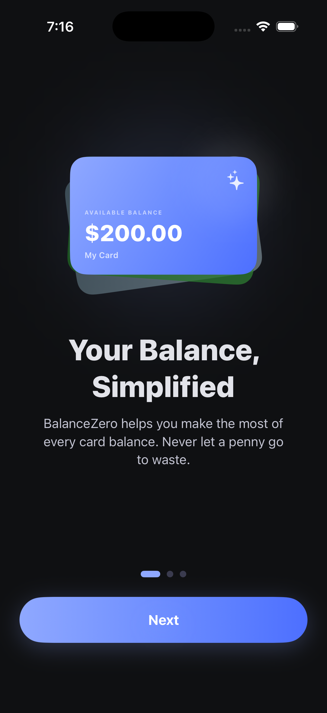<br/><sub>Your Balance, Simplified</sub></td>
  <td align="center">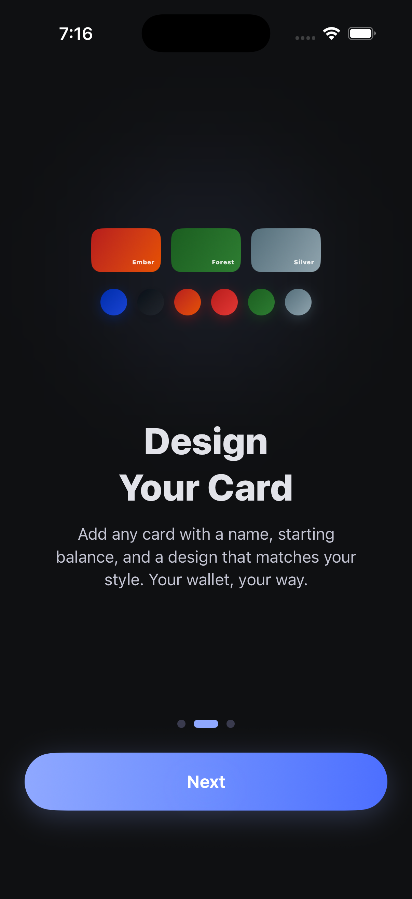<br/><sub>Design Your Card</sub></td>
  <td align="center">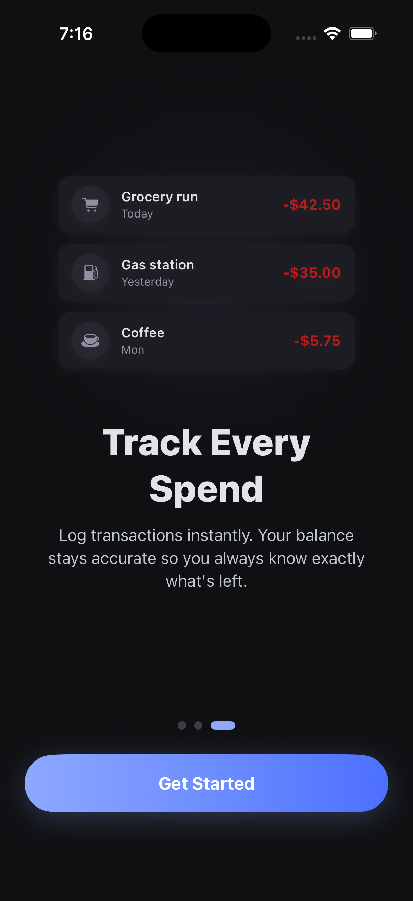<br/><sub>Track Every Spend</sub></td>
</tr></table>

<br/>

A three-screen first-launch flow shown once on install. The first screen frames the core idea — spending a card balance to the cent. The second walks through picking a card design and entering a starting balance. The third demonstrates logging a transaction. Dismissed permanently once the user taps through.

---

## Wallet

<table align="center"><tr>
  <td align="center">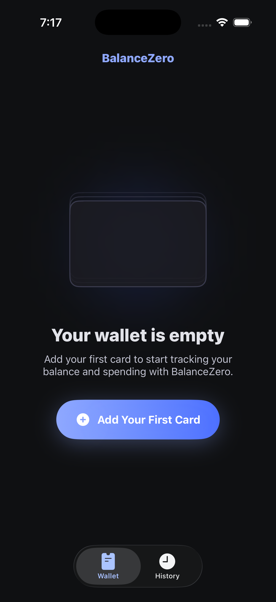<br/><sub>Empty state</sub></td>
  <td align="center">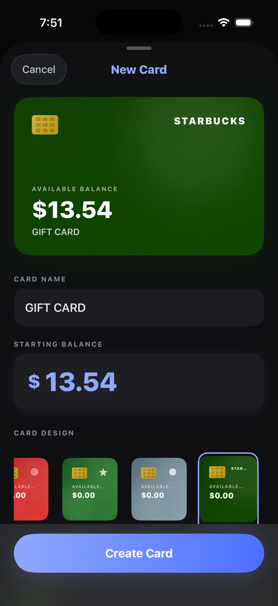<br/><sub>Adding a card</sub></td>
  <td align="center">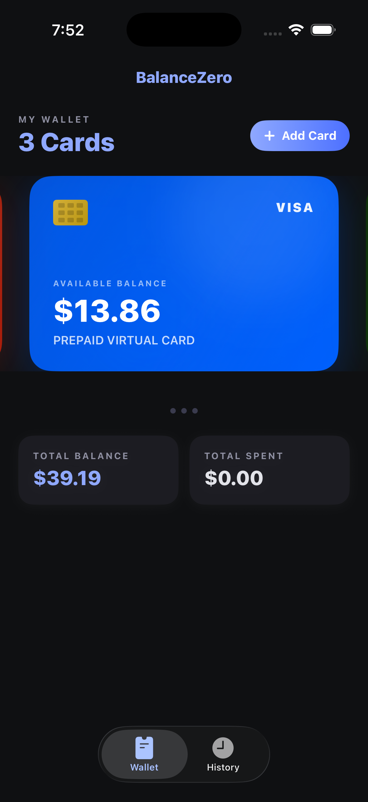<br/><sub>Wallet overview</sub></td>
</tr></table>

<br/>

- Add as many cards as you have — gift cards, prepaid Visa and Mastercard, store credit, or any fixed-balance card
- Seven built-in card designs; custom cards accept a brand name and a color of your choice
- Per-card transaction log with category icons inferred from the note (coffee, gas, groceries, and more recognized automatically)
- Balance updates immediately as you log transactions; current balance and total spent shown at a glance
- Aggregate view of total balance and total spent across all cards in your wallet

---

## Card Detail & Transactions

<table align="center"><tr>
  <td align="center">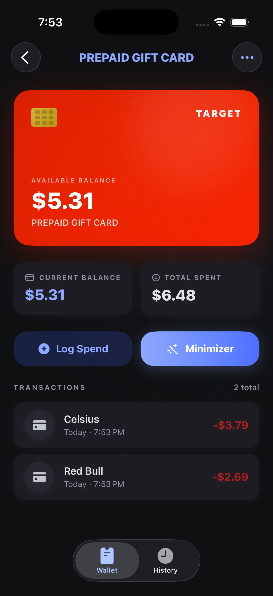<br/><sub>Card detail</sub></td>
  <td align="center">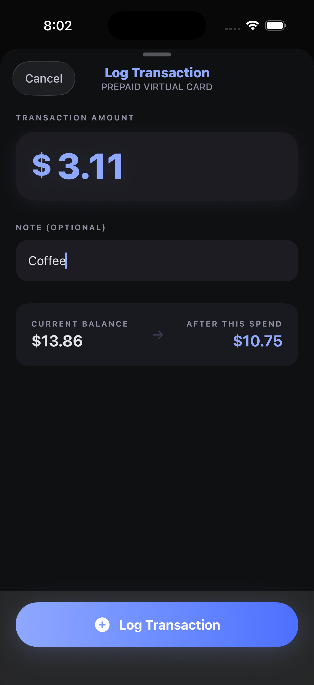<br/><sub>Log a transaction</sub></td>
</tr></table>

<br/>

- Tap any card to see its full transaction history, remaining balance, and total spent at a glance
- Open the Minimizer directly from a card to find the best combination for that card's remaining balance
- Log a new transaction with an amount and an optional note; the balance updates immediately
- Category icons are inferred automatically from the note — common keywords like "coffee", "gas", and "groceries" map to the matching SF Symbol

---

## Minimizer

<table align="center"><tr>
  <td align="center">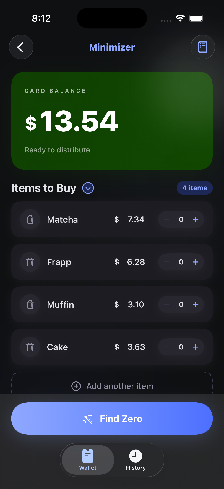<br/><sub>Minimizer input</sub></td>
  <td align="center">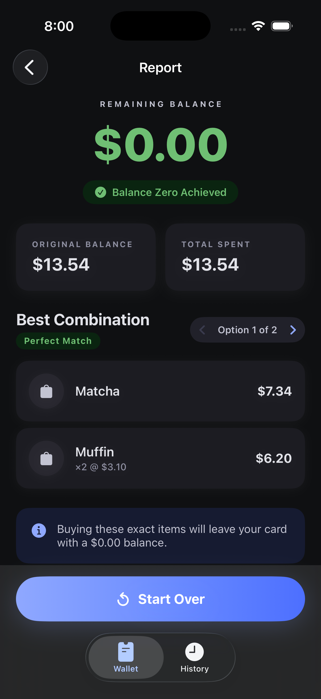<br/><sub>Option 1 of 2</sub></td>
  <td align="center"><br/><sub>Option 2 of 2</sub></td>
</tr></table>

<br/>

- ATM-style input fields — digits land correctly from the right; no cursor positioning required
- Optional mandatory quantities per item: *exactly N* locks a precise count; *at least N* lets the optimizer add more units of that item if it helps reach zero
- Load a saved item list into the current session in one tap
- Report shows remaining balance, original balance, and total spend; remaining balance turns green and shows a confirmed badge when zero is achieved
- Multiple equally optimal combinations are all surfaced and browseable with a `< Option X of N >` navigator — useful when one combination is more practical even though mathematically tied

---

## Saved Lists

<table align="center"><tr>
  <td align="center">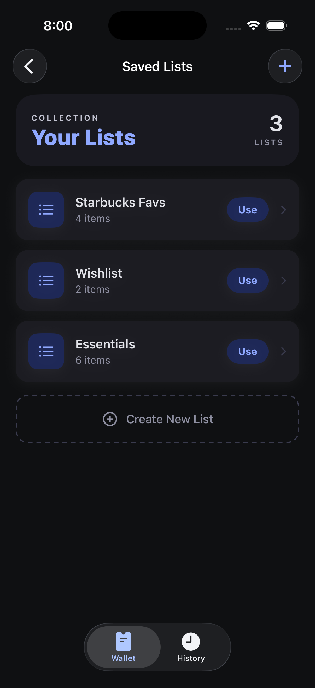<br/><sub>Your lists</sub></td>
  <td align="center">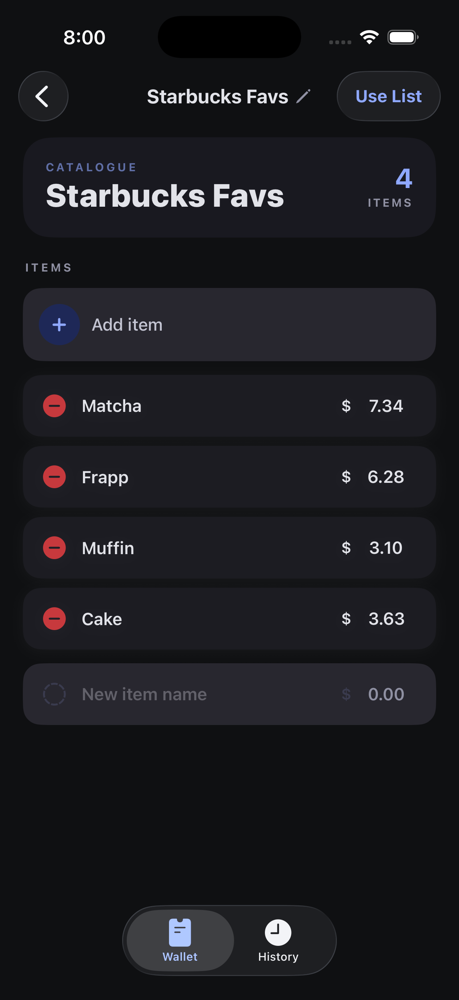<br/><sub>List detail</sub></td>
</tr></table>

<br/>

- Create named catalogues of items with prices for stores you shop at regularly
- Edit name, add items, and remove items at any time
- One tap loads a list directly into the Minimizer

---

## History

- Every Minimizer run saves automatically
- Tap any past result to replay the full report, including all the combinations found at the time
- Month-to-date spend total and perfect-match count shown at the top when history exists
- Swipe to remove individual entries; clear all at once from the toolbar with a confirmation prompt

---

## How the Optimizer Works

The core problem is a bounded variant of subset-sum: given a target balance in integer cents and a set of items with prices and optional quantity limits, find the selection whose total cost is as high as possible without exceeding the balance, with exact zero preferred.

The engine builds a dynamic programming table over integer cents, which keeps all arithmetic exact with no floating-point drift. During the fill phase, instead of recording just the optimal value at each capacity, it records every item choice that achieves that value — turning the DP table into a directed acyclic graph. Once the optimal spend is identified, a depth-first search enumerates all paths from that spend back to zero through the predecessor graph. Each path is a valid combination. Paths that represent the same multiset of items (same items and quantities, different enumeration order) are deduplicated before the results are returned. A cap of one hundred combinations prevents worst-case explosion.

Mandatory quantities are handled in a pre-pass. Items marked *exact N* are pre-committed and excluded from the DP entirely; their cost is subtracted from the budget before the table is built. Items marked *at least N* are pre-committed at their base quantity but still participate in the DP for any additional units. The final output merges the pre-committed quantities, the DP selections, and per-item totals into a single coherent result.

The computation runs on a background thread via Swift structured concurrency and re-enters the main actor to publish results when complete.

---

## Tech Stack

| | |
|---|---|
| Language | Swift |
| UI framework | SwiftUI |
| Persistence | SwiftData |
| Architecture | MVVM — `InputViewModel` and `ReportViewModel` bound to `@MainActor` |
| Concurrency | Swift structured concurrency — detached tasks, `@MainActor` result delivery |
| Currency input | `UIViewRepresentable` wrapping `UITextField` for cursor-pinned ATM-style entry |
| Optimization engine | `BalanceOptimizer.swift` — custom DP with predecessor tracking and DFS enumeration |
| Deployment target | iOS 18+ |
| Third-party packages | None |

---

## Project Structure

```
BalanceZero/
├── App/
│   ├── BalanceZeroApp.swift           # Entry point, SwiftData container, root scene
│   ├── AppTheme.swift                 # Color palette, type scale, corner radii
│   └── CurrencyInputHelper.swift      # Digit-string to formatted currency conversion
│
├── Engine/
│   └── BalanceOptimizer.swift         # DP table, predecessor graph, combination enumeration
│
├── Model/
│   ├── ShoppingItem.swift             # Input item: name, price, quantity constraint
│   ├── OptimizationResult.swift       # Result type: selected lines, match quality, all combos
│   ├── CardModels.swift               # SwiftData: Card + CardTransaction
│   ├── SavedCalculationModels.swift   # SwiftData: SavedCalculation + JSON combo payload
│   └── SavedItemModels.swift          # SwiftData: SavedItemList + SavedItem
│
├── ViewModel/
│   ├── InputViewModel.swift           # Balance state, item list, calculate pipeline
│   └── ReportViewModel.swift          # Combo navigation, display formatting, summary copy
│
└── View/
    ├── MainTabView.swift              # Root tab bar: Wallet + History
    ├── Onboarding/                    # Three-screen first-launch flow
    ├── Cards/                         # Wallet overview, card detail, creation, transaction log
    ├── InputView/                     # Minimizer input screen and item rows
    ├── ReportView/                    # Result display and combination navigator
    ├── History/                       # Calculation history list
    ├── SavedLists/                    # List browser and detail editor
    └── Components/                    # CurrencyPriceField and shared UI pieces
```

---

## Tests

The project ships two test targets built with different frameworks.

### Unit Tests — `BalanceZeroTests`

Written with Swift Testing (`@Suite`, `@Test`, `#expect`). Ten suites covering the optimizer engine, persistence models, and both view models.

| Suite | What it covers |
|---|---|
| **Balance Optimizer** | Perfect, partial, and no-solution outcomes; mandatory quantity constraints (exact and minimum); multiple-combination enumeration and deduplication; performance ceiling of 3 seconds at maximum supported balance |
| **Currency Input Helper** | Digit extraction and formatting; cents-to-string and string-to-cents conversion; round-trip fidelity across all common values |
| **Input View Model** | Initial state; item add and remove; name and price mutations; balance parsing with dollar signs and commas; `canCalculate` guard; validation messages; async calculate pipeline tested against a mock optimizer; reset behavior |
| **Report View Model** | Match label and quality flags; combination index navigation with clamping at bounds; display formatting for balance, spent, and remaining; `summaryMessage` copy for all three match states |
| **Card Model** | Balance computation with zero, multiple, and overflowing transactions; `clampedCurrentBalance`; cascade delete; design raw-value round-trips; invalid raw value fallback to `.classic` |
| **Card Transactions** | Note and amount persistence; back-references to parent card; zero-amount transactions; `createdAt` auto-population; deleting a transaction without deleting the card |
| **Card Design** | All seven designs present with unique raw values, non-empty display names, exactly two gradient colors each, and a valid SF Symbol name |
| **Saved Calculation Serialization** | `SavedCalculation.from()` factory; match quality encoding and decoding for all three cases; card metadata preservation; all-selections JSON round-trip with 50-item payloads; fallback behavior for nil and corrupted data blobs |
| **Saved Calculation Persistence** | SwiftData fetch, cascade delete of result items, back-references from result item to parent calculation, and card metadata survival independent of a live `Card` model |
| **Saved Item List** | Create with items; cascade delete; item and list name mutation; edge cases including empty name, 500-character name, duplicate names across lists, zero-price items, and a 100-item stress test; descending sort by `createdAt` |

### UI Tests — `BalanceZeroUITests`

Written with XCTest. Cover the primary user flows end-to-end on a live simulator.

- App launches to the Wallet tab showing empty state; History tab shows its own empty state and switching back restores the wallet
- Card creation: tapping "Add Your First Card" opens the sheet; Cancel dismisses it; Create Card is disabled until both name and balance are entered
- Wallet with a card: card name and count appear after creation; tapping the card navigates to card detail
- Minimizer flow: card detail exposes the Minimizer button; the Minimizer opens with the correct navigation title; Find Zero is disabled without a priced item
- History integrity: visiting the Minimizer without running a calculation leaves the History tab empty

### Running the Tests

In Xcode, press `Cmd U`. From the terminal:

```bash
xcodebuild test \
  -scheme BalanceZero \
  -destination 'platform=iOS Simulator,name=iPhone 17 Pro'
```

---

## Getting Started

**Requirements:** Xcode 17 and an iOS 18 simulator or device.

```bash
git clone https://github.com/keyursavalia/BalanceZero.git
cd BalanceZero
open BalanceZero.xcodeproj
```

Press `Cmd R`. There are no API keys, no backend services, and no packages to resolve. The optimizer runs on-device and SwiftData handles all persistence in the app sandbox.

---

## What's Next

- **Share sheet** — export a combination as formatted text to send to whoever has the cart
- **Home screen widget** — glanceable last balance and match quality without opening the app
- **Accessibility pass** — thorough VoiceOver and Dynamic Type testing across all screens
- **Budgeted mode** — optimize toward a spend target below the card balance, for when you have a budget limit on top of a fixed card
- **SwiftData schema versioning** — lightweight migration plan in place before users accumulate meaningful history

---

## Contributing

Fork the repo, create a branch off `main`, and open a pull request. One fix or feature per PR keeps review tractable. Bug reports and ideas are welcome as GitHub issues.

---

## License

[MIT](LICENSE) · © 2026 Keyur Savalia
